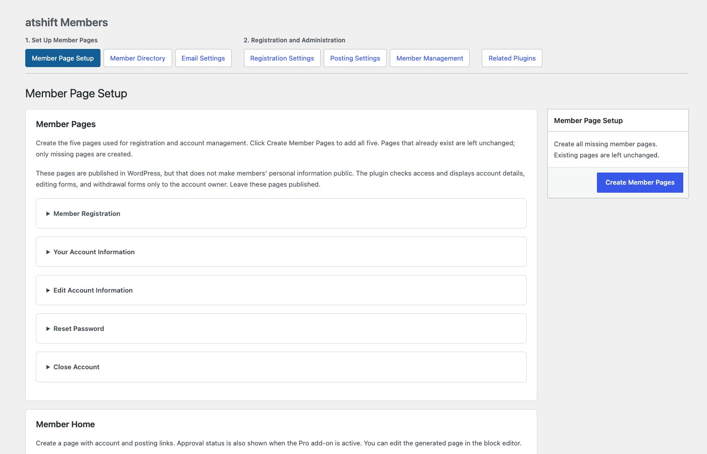
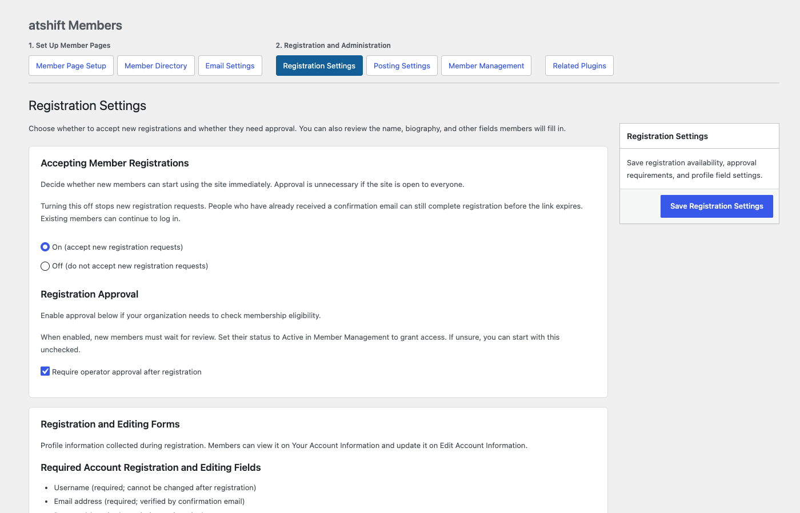
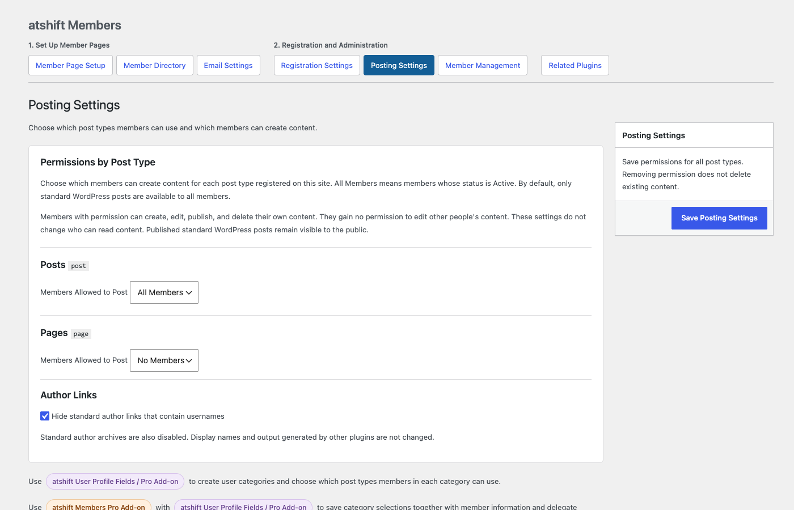
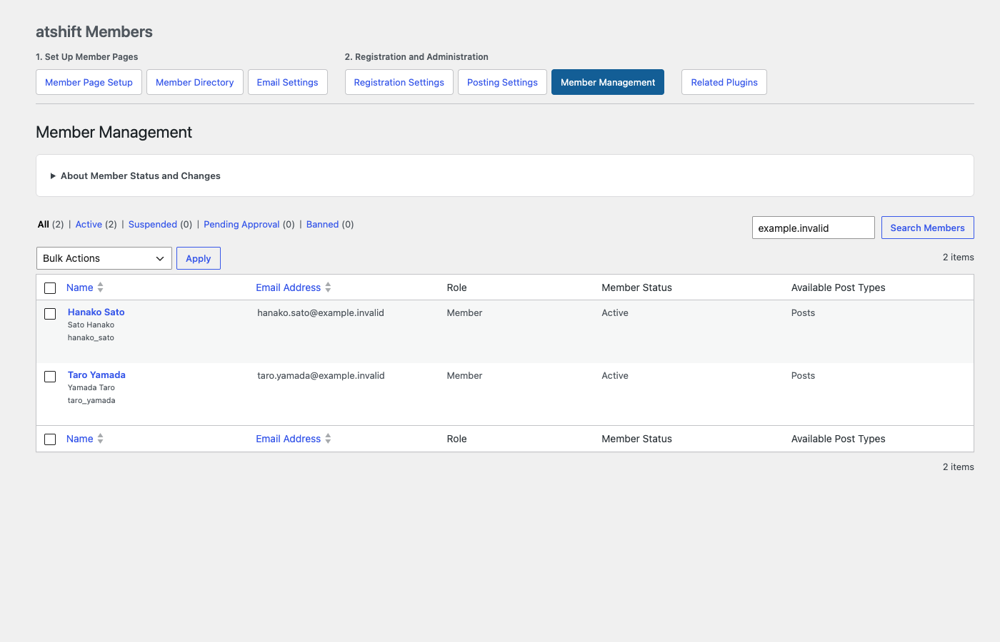
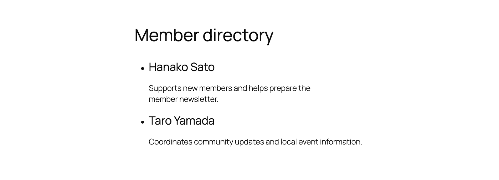

# atshift Members

atshift Members is a WordPress plugin for building a simple, understandable membership site. It brings member registration, self-service account management, posting permissions, member-only content, a member directory, and private attachments into one workflow.

## Features

- Email-verified registration with a choice between immediate access and administrator approval.
- One-click creation of five pages for registration, account information, profile editing, password resets, and account closure.
- An optional member home that shows each member the account and posting links relevant to them.
- Member status management for active, pending, suspended, and blocked accounts.
- Per-post-type permissions for members to create, edit, publish, and delete their own content without granting access to other users' posts.
- Member-only visibility for selected posts and pages.
- An optional member directory with configurable audience and fields, including per-user exclusions for accounts such as site builders.
- Private attachment storage outside the public WordPress upload area or on a file-server/NAS share already mounted by the host.
- Controls for hiding standard author archives and username-based author links.

## Screenshots

### Member Page Setup

### Registration Settings

### Posting Settings

### Member Management

### Member Home

### Member Directory

## Installation

1. Install and activate the plugin on a WordPress 6.6 or later single-site installation running PHP 8.1 or later.
2. Open **Members > Member Page Setup** and create the five member pages. Keep these pages published; the plugin checks the visitor before displaying account details and forms.
3. Open **Registration Settings** and choose whether to accept registrations, require administrator approval, and collect the built-in profile fields.
4. Add the Cloudflare Turnstile site and secret keys.
5. Review posting permissions, email settings, directory visibility, and private-file storage.
6. Exclude member pages from page caches and shared CDN caches. Verify cron and outgoing email before opening registration.

HTTPS is required, except in local development environments where `WP_ENVIRONMENT_TYPE=local`. Cloudflare test keys cannot be used in production.

## Shortcodes

Account procedures:

- `[atshme_registration]`
- `[atshme_account]`
- `[atshme_account_edit]`
- `[atshme_password_reset]`
- `[atshme_withdraw]`

Member navigation and directory:

- `[atshme_dashboard]`
- `[atshme_account_links]`
- `[atshme_post_links]`
- `[atshme_approval_status]` (shows approval data when the Pro add-on is active)
- `[atshme_member_directory]`

See [Dashboard Shortcodes](docs/DASHBOARD-SHORTCODES.md) and [Member Directory and Visibility](docs/MEMBER-DIRECTORY.md) for details.

## Optional integrations

- **atshift User Profile Fields** adds fields such as telephone numbers and addresses and lets administrators arrange profile forms.
- **atshift User Profile Fields / Pro Add-on** adds hierarchical member classifications such as branches, departments, and membership types.
- **atshift Freeform Login** customizes the login experience and adds passkey registration and management in supported environments.
- **atshift Members Pro Add-on** adds post review, announcement email and scheduling, delegated responsibilities and management scopes, and CSV member invitations.

Each integration and paid add-on is a separate product and is not included in this repository.

## Member-only files

Standard WordPress Media Library uploads remain public. Files that must be limited to members should be stored in a dedicated directory outside the public web root or on a file-server/NAS share already mounted on the WordPress server. Every download rechecks the member's current status and access to the parent content.

## External services

- **Cloudflare Turnstile** protects registration and password-reset request forms from automated abuse. When a form is submitted, the response token and the site administrator's secret key are sent to Cloudflare Siteverify.
- **Pwned Passwords** checks whether a new or changed password has appeared in a known breach. Only the first five characters of the password's SHA-1 hash are sent to the range API; the password and full hash are never sent or stored.

The data sent, retention behavior, and links to the applicable terms and privacy policies are documented in the [WordPress.org readme](readme.txt).

## Operational notes

- Version 1.0 supports WordPress single-site installations.
- Disable shared caching for all member pages.
- Before production use, test registration, confirmation email, login, posting, access control, private files, and account closure on a staging site.
- Review any REST API, profile, or SEO data exposed by optional third-party plugins separately.

## Development and validation

Runtime packages are built with `tools/build-package.py`; tests, QA artifacts, repository metadata, and development tools are excluded from installable ZIP files. Translation catalogs are maintained with `tools/build-languages.py`.

The current release targets WordPress 6.6 or later and PHP 8.1 or later. Validate changes in an isolated WordPress database before use. The project test runners intentionally refuse non-test databases.

## License

GPL-2.0-or-later. See [LICENSE](LICENSE).
